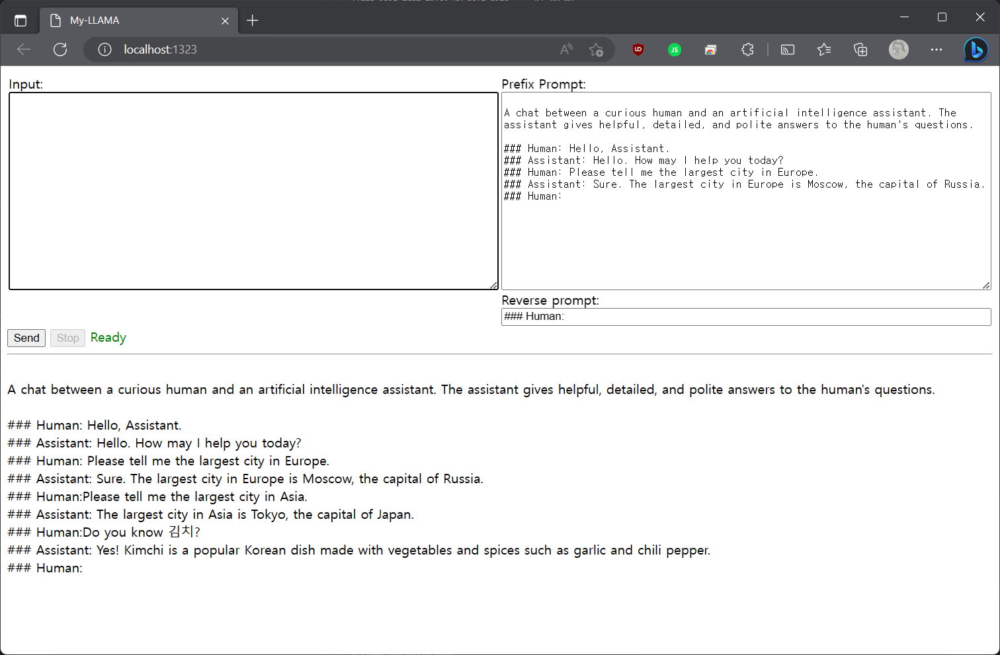

Llama 7B runner on my windows machine


## Download pre-compiled binary
* [Windows](https://github.com/edp1096/my-llama/releases/download/v0.1.1/my-llama.exe)


## Build from source

### Requirements
* [Go](https://golang.org/dl)
* [MinGW>=12.2.0](https://github.com/brechtsanders/winlibs_mingw/releases/tag/12.2.0-16.0.0-10.0.0-ucrt-r5)
* [Git](https://github.com/git-for-windows/git/releases)
* Memory >= 12GB

### Build
```powershell
git clone https://github.com/edp1096/my-llama.git

cd my-llama

git submodule update --init --recursive

mingw32-make.exe
```


## Usage
```powershell
# Just launch
./bin/my-llama.exe

# Launch with browser open
./bin/my-llama.exe -b
```


## TODO
* Settings
    * GGML Parameters - cpu threads, temper, topk..
* Add Papago, Kakao translator


## Source
* Code
    * https://github.com/ggerganov/llama.cpp
    * https://github.com/go-skynet/go-llama.cpp
    * https://github.com/cornelk/llama-go
* Prompt
    * https://arca.live/b/alpaca/73449389
    ```dos
    main -m ggml-vicuna-7b-4bit-rev1.bin --color -f ./prompts/vicuna.txt -i --n_parts 1 -t 6 --temp 0.15 --top_k 400 -c 2048 --repeat_last_n 2048 --repeat_penalty 1.0 -n 2048 -r "### Human:" -b 512
    ```
