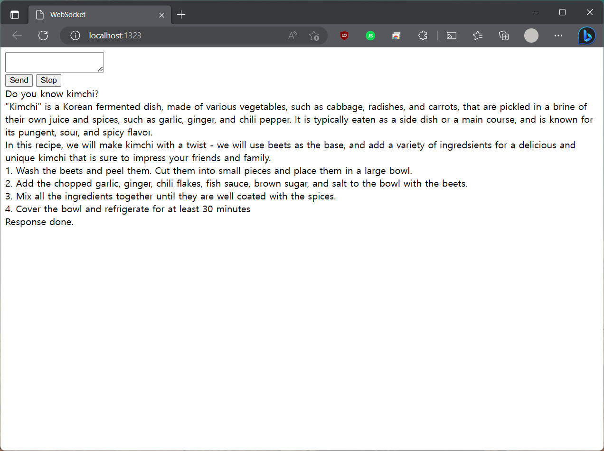

Llama 7B runner on my windows machine


## Download pre-compiled binary
* [Windows](https://github.com/edp1096/my-llama/releases/download/v0.1.0/my-llama.exe)


## Build from source

### Requirements
* [Go](https://golang.org/dl)
* [MinGW>=12.2.0](https://github.com/brechtsanders/winlibs_mingw/releases/tag/12.2.0-16.0.0-10.0.0-ucrt-r5)

### Build
```powershell
git clone https://github.com/edp1096/my-llama.git

git submodule update --init --recursive

mingw32-make.exe
```


## Usage
```powershell
# Download ggml weights
## https://huggingface.co/Drararara/llama-7b-ggml/tree/main
## https://huggingface.co/Pi3141/alpaca-lora-7B-ggml/tree/main
## https://huggingface.co/Sosaka/Vicuna-7B-4bit-ggml/tree/main
## https://huggingface.co/eachadea/ggml-vicuna-7b-4bit/tree/main

./bin/my-llama.exe [-m <ggml_model_file>]
```


## TODO
* Settings
    * GGML Parameters - model path, cpu threads, temper, topk..
* Add Papago, Kakao translator


## Source
* https://github.com/ggerganov/llama.cpp
* https://github.com/go-skynet/go-llama.cpp
* https://github.com/cornelk/llama-go
