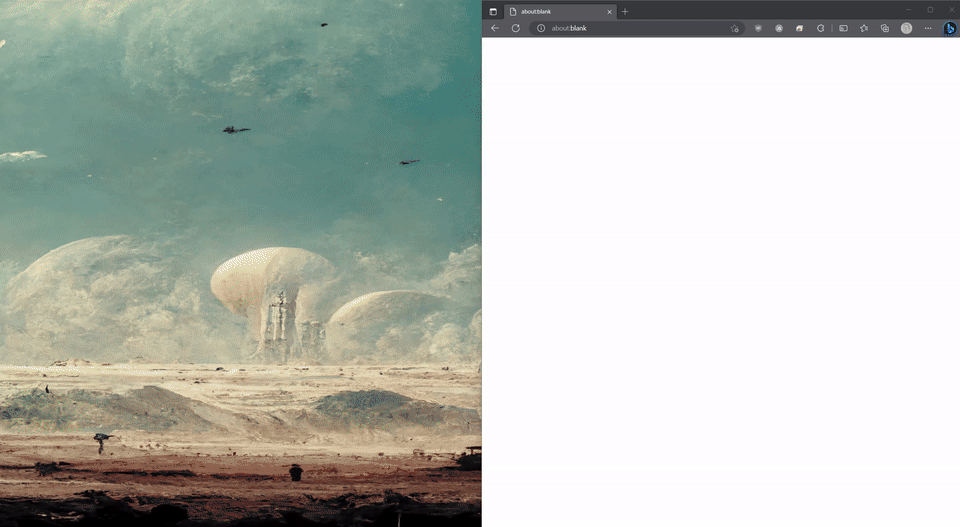

내 컴퓨터에서 돌리는 로컬 라마7B 실행기

## 뭐냐면요..

* `llama.cpp/examples/main`에 있는 코드 interactive 모드를 흉내낸 Go언어 바인딩
* 간단한 웹소켓 서버
* 간단한 Go언어 embed 웹ui


## 실행파일 다운로드
* ggjt v2 - 바뀐거
    * [MS윈도우 cpu](https://github.com/edp1096/my-llama/releases/download/v0.1.8/my-llama_cpu.exe)
    * [MS윈도우 cuda](https://github.com/edp1096/my-llama/releases/download/v0.1.8/my-llama_cu.zip) - [CUDA Toolkit 12.1](https://developer.nvidia.com/cuda-downloads?target_os=Windows&target_arch=x86_64)를 설치해야됩니다. 아니면 [DLL](https://github.com/ggerganov/llama.cpp/releases/download/master-e6a46b0/cudart-llama-bin-win-cu12.1.0-x64.zip)파일들을 다운받아서 실행파일 폴더에 넣어주세요. 그리고 VRAM 7GB 이상 필요합니다.
    * [MS윈도우 clblast] - (https://github.com/edp1096/my-llama/releases/download/v0.1.8/my-llama_cl.zip)
* ggjt v1 - 예전거
    * [MS윈도우 cpu](https://github.com/edp1096/my-llama/releases/download/v0.1.8/my-llama_cpu_old_ggml.exe)
    * [MS윈도우 cuda](https://github.com/edp1096/my-llama/releases/download/v0.1.8/my-llama_cu_old_ggml.zip) - [CUDA Toolkit 12.1](https://developer.nvidia.com/cuda-downloads?target_os=Windows&target_arch=x86_64)를 설치해야됩니다. 아니면 [DLL](https://github.com/ggerganov/llama.cpp/releases/download/master-e6a46b0/cudart-llama-bin-win-cu12.1.0-x64.zip)파일들을 다운받아서 실행파일 폴더에 넣어주세요.
    * [MS윈도우 clblast](https://github.com/edp1096/my-llama/releases/download/v0.1.8/my-llama_cl_old_ggml.zip)


## 실행 방법
```powershell
# 실행만
./bin/my-llama.exe

# 실행하면서 웹브라우저 같이 띄우기
./bin/my-llama.exe -b
```
* 파라미터가 말을 안듣는 것 같으면 브라우저 새로고침 하세요

## 소스 빌드하기

### 요구사항
* CPU
    * [Go](https://golang.org/dl)
    * [MinGW>=12.2.0](https://github.com/brechtsanders/winlibs_mingw/releases/tag/12.2.0-16.0.0-10.0.0-ucrt-r5)
    * [Git](https://github.com/git-for-windows/git/releases)
    * Memory >= 12GB
* GPU/CUDA
    * [Go](https://golang.org/dl)
    * [MinGW>=12.2.0](https://github.com/brechtsanders/winlibs_mingw/releases/tag/12.2.0-16.0.0-10.0.0-ucrt-r5)
    * [Git](https://github.com/git-for-windows/git/releases)
    * [MS Visual Studio 2022 Community](https://visualstudio.microsoft.com/vs)
    * [Cmake >= 3.26](https://cmake.org/download)
    * [CUDA Toolkit 12.1](https://developer.nvidia.com/cuda-downloads?target_os=Windows&target_arch=x86_64)
    * CPU Memory >= 12GB
    * Video Memory >= 7GB
        * GPU 토큰 생성에 사용되는 `n_gpu_layer` 값을 3060ti 기준으로 24로 잡아놔서 그렇습니다.
        * 다른 nvidia gpu에서 돌리려면 [cgollama/binding.cpp](/cgollama/binding.cpp)에서 `n_gpu_layer`값을 바꿔주세요.
* GPU/CLBlast
    * [Go](https://golang.org/dl)
    * [MinGW>=12.2.0](https://github.com/brechtsanders/winlibs_mingw/releases/tag/12.2.0-16.0.0-10.0.0-ucrt-r5)
    * [Git](https://github.com/git-for-windows/git/releases)
    * [MS Visual Studio 2022 Community](https://visualstudio.microsoft.com/vs)
    * [Cmake >= 3.26](https://cmake.org/download)
    * [OpenCL-SDK](https://github.com/KhronosGroup/OpenCL-SDK), [CLBlast](https://github.com/KhronosGroup/OpenCL-SDK)
        * <b>빌드스크립트에 다운로드, 빌드 명령 포함되어있으므로, 수동으로 다운받을 필요 없습니다.</b>
        * 버전숫자를 바꾸려면 [build_cl.cmd](/build_cl.cmd)파일을 수정해주세요.
    * CPU Memory >= 12GB
    * Video Memory >= 4GB

### 컴파일
* CPU
```powershell
git clone https://github.com/edp1096/my-llama.git

cd my-llama

git submodule update --init --recursive

mingw32-make.exe
```
* GPU/CUDA
```powershell
git clone https://github.com/edp1096/my-llama.git

cd my-llama

git submodule update --init --recursive

build_cu.cmd
```
* GPU/CLBLast
```powershell
git clone https://github.com/edp1096/my-llama.git

cd my-llama

git submodule update --init --recursive

build_cl.cmd
```


## 출처/참고
* 코드
    * https://github.com/ggerganov/llama.cpp
    * https://github.com/go-skynet/go-llama.cpp
    * https://github.com/cornelk/llama-go
* 프롬프트
    * https://arca.live/b/alpaca/73449389
    ```dos
    main -m ggml-vicuna-7b-4bit-rev1.bin --color -f ./prompts/vicuna.txt -i --n_parts 1 -t 6 --temp 0.15 --top_k 400 -c 2048 --repeat_last_n 2048 --repeat_penalty 1.0 -n 2048 -r "### Human:" -b 512
    ```
